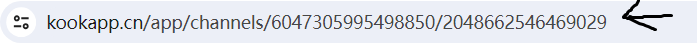
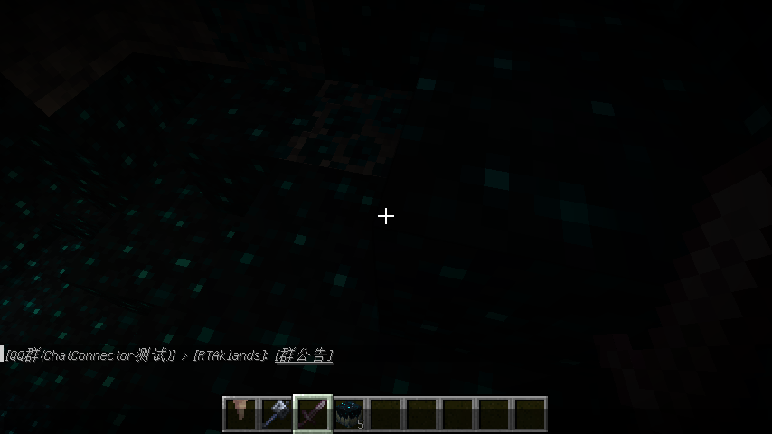
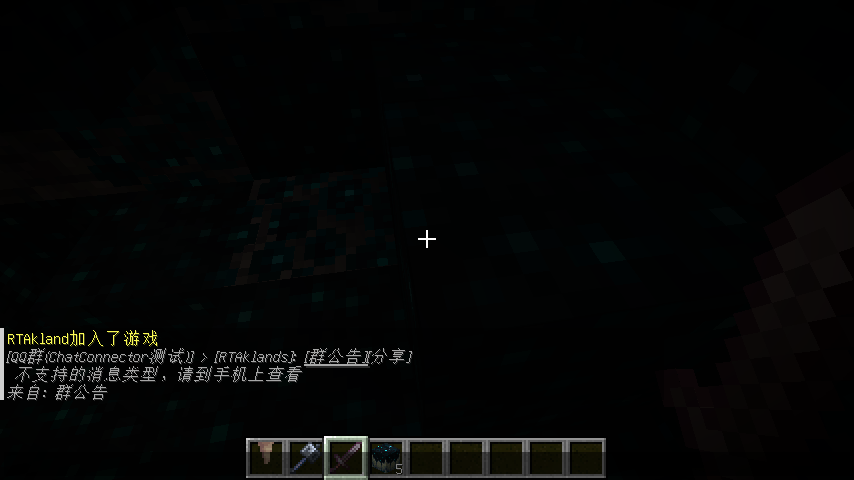

<div align="center">


<h2>ChatConnector</h2>

<h3>⭐一个可以互通QQ/Discord/Kook和MC消息以及子服消息同步的Velocity插件⭐</h3>


<img src="https://img.shields.io/badge/Kook-v3-33FF00?logo=data:image/x-icon;base64,AAABAAEAAAAAAAEAIABdHAAAFgAAAIlQTkcNChoKAAAADUlIRFIAAAEAAAABAAgGAAAAXHKoZgAAHCRJREFUeNrt3XmQldW57/Hv2j3RdNPQdCOTiAh9EQwIAUXuzYkJxyhYB9B4YiIKDic3yRUKGSKTw1WLElqwASNWkXgSpdSkFE0CKT3JydV4YiJC8GgMRAbBjsEw9AA0zYYe9rp/bBoa6GGP69nv+z6fqq5Cunu/v7XlffZa77vetQwe9hNLl4O1lBnLUCxDIzDUQB+gW8uXbfmzJVs6r/IQQxNQZ6COVl8WDoRgJ4ad1rCzdzG77zaclI6beDM9ZNkRLqOZCcbyVSzjrWEglpB0LhVghoiBvwF/tIa3yOLNxT3YKx0r9vgZrMKS31DDZCwTLUzAMlA6k1KdMlQaeDNk+HV2TzbOM4SlI7UfNcNYi1lxhC9Hmplh4V+xFElnUiphhmMGNoSyWH9/D/7LGKx0pHPjZYjVx+kdDjMTwwz9pFe+ZKjEsj4/n7VzCjkoHScaSdiT1QxotNyP5dsW8qXzKJVuBsIYns0xrJhfwmfCWWRUHGVIQwOLMMywlhzJN0EpCcbQiGV9bi7L53Vnj0gG1wdcayk8XsMjEct9emtOKcDQFDKsKezJIzMNx90e2qFl1XwDyyos/V0eVylPMOzHMHdxCa+4O6QDTxylLNLIWmv5mquGKeVVxvCfoRxmLujO7rQfK90HKK/iTmtZa6Eg3cdSyi8M1BvDzIWlPJ/m46THOkvX2mrWWstd6WyAUn5mDM8VlzDzu4YTaXn9dLzo8mqusJaXsQxP79ujVAAYdhjDrYtK2J7ql075PPryw0yxEbboya9UiliG2whbyg8zJdUvndICsKyae6zhNaCrszdHqWDoag2vlVfzb6l80ZQVgPIqFhPh360ly/17o5T/WUtWJMKz5VUsTtVrJn0NwFpMeTWrrOU+2bdHqQAxPLWohDnJPlyU9Ew8PfmVEmCZvbwaILlzL6khQHkVi/XkV0qIZXayw4GEhwDLqrmHCP8u/R4oFXShEN9eWJLYuZhQASg/zBRreE0v+CklzxiajeXrC3uxMe7fjfcXlldzhY2wBb3Vp1QmOWFCXB3vZKG4rgGss3S1lpfRk1+pTNPVWl5eZ+M7N+MqADXVPKMz/JTKUJbhNdU8E8+vxFwAyqu4E8ud0m1USnXAcmd5VeznaUzXAJ44SllzAx+gXX+lvOBEVi6jYllPIKYeQKSRtejJr5RXdD19znaq0wKwvJpbdSUfpbzFWr62vJpbO/u5DocAay2Fx6r5WNfwU8qDDPuLSri8o4VGO+wB1FXxqJ78SnmUpX9dFY929CPt9gAqjjLkVCN/1aW7lfIwQ1NeDsPa23eg3R5AQwOL9ORXyuMs2Q0NLGrv2232AE5v1/WJ7tijlPcZQ2OOYXBb25C12QNosCzQk18pf7CWnAbLgra+d0EPYPVxep8Ms0836lTKPwyEu+Qz6PxdiS/oAZw8ySw9+ZXyFwv5J08y6/y/P6cAWIuxMF06rFIq9SxMt/bcXv85BWB5FddiGSgdVCmVBpaBy6u4tvVfnVMAjNFPf6X87Pxz/Ex3oMKSf6qaA1iKpEMqpdLEcCyvhD7zDGFo1QNoqmGKnvxK+ZylqKnm7BZjZwpAxDJROptSKv1an+tnCoCFr0oHU0qlX+tzPQSw7AiX6dV/pQLCMnDZES6Dlh5AMxOkMymlHDp9zkcLQEQLgFKBEmlVAIxhvHQepZQ7Lee8+Ymly4Fq6rHJbRSqlPIQQ6RPCQWhg7WU6cmvVMBYQgdrKQsZy1DpLEop94xlaAgtAEoFk2VoKIIWAKWCKAJDQ0Bf6SBKKRF9s4Fu0ikyyT+2w8/nSadQmaSgFKavh1CWdJKU66YF4DyfbobP3pdOoTLNtp/CVXdIp0i5biEDhdIpMome/Kotvy2HxrB0itQyUBiy2gM4x9+1AKg2HDsA76yTTpFaFrqF0AJwxsk6OLwn+ddR/vT2U1BfI50ipbqFdPuvs/TTX3XkVB28VSGdIoUs2ToFuBUd/6vObP4x1P5NOkXqaAFoRQuA6kxzI/zmcekUqaMFoJW//7d0AuUFH7wKn/9ZOkVqaAE47ejnUHcw+ddRwfDGY9IJUkMLwGna/Vfx2PN29MvrtACcpncAVLxefxSslU6RHC0Ap2kPQMXrHx/Bh69Jp0iOFgCiVXz/h9IplBf95nFoapBOkTgtAMChXXDquHQK5UW1f4vODfAqnQWI+/G/MYbnnnuO7GyZt3/79u08/nhyN7N79erFihUryMnJEWnD5s2b+cEPfiBy7PO9VQFjp0EXD+6sqQUA9+P/YcOGMWPGDLH2rlmzJqnfz8/PZ9OmTYwbN06sDR9//LHYsc93ojb6nMAND0oniZ8OAXA/Aejqq68Wbe+WLVsS/t1QKMRLL70kevIn24Z0eGdd9IlBrwl8AWg6FV0FyCUvF4BVq1Zx0003ieZPtg3p0HQS/rNcOkX8Al8APv8IIk1ujylZAGpqatizJ7FnnufOncvs2bPFsrfYvXs3tbW10jEusO0lOF4lnSI+gS8Arsf/eXl5jBw5Uqy9W7duTej3brnlFlauXCmWu7VM+/RvkZ0HXYulU8RHC8A2t8cbPXq02JVzSOzkGT9+PC+88AKhUGb8c8nUAtD/Su8tHJoZ/0cFub4A6LWLZ2VlZWzcuJEuXbqI5k6mDa4M+KJ0gvgFugCEj0D1PrfH9NIFwNLSUl5//XVKS0tFM7fW2NjIBx98IB2jTVoAPEZi/r9kAaisrOTQoUMx/WzLvf4hQ4aI5W3Ln//8Z06ePCkdo00XawHwFtcFoLi4mMGDB4u1N9ZP/1AoxIsvvsg111wjljXZNrhWUALFA6RTxC/QBUBiApAxRqy9sZ48FRUV3HzzzWI5U9EG1waMkU6QGC0ADnlh/D9nzhzuu+8+0ZzJtkHCxaOlEyQmsAWg9jM4ftjtMSULQHNzM9u2dXzP8+tf/zpPPvmkWMbO1NXVZdQzAK158QIgBLgASKwAdNVVV4m1d/v27dTX17f7/WuuuSaj7vW3Ze3atUQiEekYbdIegMe4vgA4cOBAevfuLdbejrrOQ4YMYdOmTeTn54vl68wrr7zCkiVLpGO0qWSQ92YAtghuAdDxPxC91//GG29k1L3+8/3hD39gxowZ2AxdgM+rn/4Q0AIQibhf1z0TC0CXLl3YuHFjxt3rb23Xrl1MnTo1Y+/9g3fH/xDQAnDoY2ioT/514iFZAE6cOMH27ec+8xwKhXjhhRcYP368WK7OHD58mBtvvJHq6mrpKB3y4gSgFoEsAK7H/1lZWYwZI3ej+P3336ep6dxnnleuXMktt9wilqkz4XCYyZMn88knn0hH6VAoG/qNkE6RRH7pABJc3/8fPnw4BQUFYu09v/s/e/Zs5s6dK5anM5FIhGnTpvHee+9JR+lUn+GQkznPScUtkAXAdQ8gk8b/N910E6tWrRLN05m5c+fyi1/8QjpGTAZ4+AIgBLAANIbh4F/dHjNTCsC4ceN46aWXMvpef0VFBU899ZR0jJh5efwPASwA+z+ESLPbY0quAVBVVcW+ffsYPHhwxt/rf/XVV7n//vulY8TFq88AtAhcAXDd/c/Pz+eKK64Qa++WLVsoKSnhjTfeoFevXmI5OvPuu+9yxx13ZOxMv7bkFkCvMukUyQlcAXB9AXDMmDFiG4BA9Pn5jRs3UlaWuf9S9+zZw5QpUzL6Xn9bLh4FGTyaikngNgYJ2gXAGTNm0K9fP9EMHamqqmLixIlUVXlsOV28PQGohcfrV3zqq6N7ubkkXQAy+eQPh8NMmTIl4+/1t8frFwAhYAUgaEuAZbJIJMIdd9zBu+++Kx0lYdoD8BjX4//S0lIGDRok3eyMNH/+fF577TXpGAkrvAi6Z27nKmaBKgBBG/9nqtWrV7N69WrpGEnxw6c/BKwABG0JsEz085//nPnz50vHSJoWAI+p+RRO1Lg9phaAc23evJnbb7/dU/f626MFwGMkLgBKLgGWaT755BOmTJlCOByWjpIS/UdJJ0iN4BQAx93/yy67LKNX2XGpurqaSZMmcfiw41VY06R0MOR3l06RGoEpAK4XAdXuf9TJkyeZMmUKu3fvlo6SMn7p/kNACkBzE+wP2BJgmcBay/Tp0/njH/8oHSWl/DABqEUgCsDBv0KT42nmWgDg+9//Phs2bJCOkXLaA/AY1xcAs7Oz+eIXffSvJAFPP/00FRUV0jFSLisH+so93JlyWgDSYMSIERn93H26/fKXv8zo7cWS0fcLkJ0nnSJ1AlEA9AKgO1u2bGHatGm+uNffFj91/yEABaChHg7tcnvMoBaAvXv3MnnyZE6cOCEdJW38dAEQAlAA/v4BWMcfRkEsADU1NUyaNIlDhw5JR0kr7QF4jOv5/wUFBQwbNky62U6dOnWKqVOnsmuX466WY3ndopOA/MT3BcD1BcCxY8eSlZUl3WxnrLXMmDGDd955RzpK2g0YDcZIp0gtLQApFrTu/4IFC3j55ZelYzjht/E/+LwA1B2Co/vdHjNIBeCZZ55h5cqV0jGc8dv4H3xeAFyP/yE4BWDTpk3Mnj1bOoZTXt4GvD2+LgCuu/+9e/fmkksukW522m3dupVvfetbNDc73mFFUFFfKOojnSL1fF0AdAJQ6u3bt8/39/rb4sfuP/i9AOgSYClVW1vLjTfeyMGDB6WjOKcFwGOqPoHwUbfH9HMBaLnX//HHH0tHEeHHOwDg4wLgegUgY4xvlwCz1nLXXXfx+9//XjqKCGOi24D5kW8LgOvx/5AhQyguLpZudlo8/PDD/OxnP5OOIaZXGeQVSqdID98WgM+2uT2en7v/PXr0kI4gyq/df/BpAWhuhH9sd3vMcePGSTc7bWbNmhWI25vtGTBGOkH6+LIA/GM7NJ1ye0w/9wDy8vJYunSpdAwxA3w4AaiFLwuA6wlAOTk5jBo1SrrZaXX77bczcuRI6RjOZedBn+HSKdLHlwXA9QXAK6+8krw8H60T1YZQKER5ebl0DOf6jYiuA+hXviwA+gRgekycOJEJEyZIx3DKzxcAwYcF4GQdVO1xe8ygFACA8vJyjN8eiu+AX2cAtvBdAdj/AVjr9phBKgBjx47lm9/8pnQMZ/z4BGBrvisArrv/RUVFDB06VLrZTi1dupScHB8PjE/L7wGll0mnSC8tAEkaO3YsoZDv3sYODR48mO9973vSMdLO75/+4MMCoI8Au/HQQw/RrVs36Rhp5ffxP/isABw7EP1yKagFoFevXixYsEA6RlppD8BjXHf/IbgFAGDu3Ln07dtXOkbaaA/AY1x3//v160f//v2lmy2moKCARx55RDpGWvS4GAp7SadIP18VAJ0A5N4999zjy7sgQfj0Bx8VAGuj24C5pAUguhX6smXLpGOknN9nALbwTQE4vBtO1bk9phaAqJtvvpnx48dLx0gpPz8B2JpvCoDr7r+flwBLxBNPPCEdIWVMCPpfKZ3CDd8UANcXAC+//HKKiorE2mtdz3fuxJe+9CWmTp0qHSMlel8OuQXSKdzwTQEI2gXAioqKjCsCy5Yt88XGqEEZ/4NPCkDTKTiww+0xpQvAunXrePHFF0UznG/YsGHcfffd0jGSFpTxP/ikAHz+l+g6gC5JFoDa2lp2797NQw89RENDg1iOtjz66KN07dpVOkZSgnILEHxSAFyP//Py8kSXx9q6dSsAn376KU8//bRYjrb069ePOXPmSMdIWE4+XHS5dAp3fFEAXI//R40aRW5urlh7t2zZcubPjz/+OEePOt4CqRMLFy6kpKREOkZC+o2ErGzpFO74ogAEbQ/A995778yfq6urWb58uWie8xUVFfHggw9Kx0hIkLr/4IMCED4a3QfQJekC0DIEaLFmzRr2798vmul89957L4MGDZKOEbcgPAHYmucLgOtPf5AtAJWVlRfszhsOh3n44YfFMrUlNzfXk3sJaA/AY1yP/3v06EFZWZlYe1uP/1t7/vnn2bHD8b3QTtx2222MHu2dj9SuPaHnQOkUbnm+ALi+A3DVVVeJrorbXgFobm5m4cKFYrnaYozx1BThoH36gw8KgOttwKXH/+0VAIBf/epXGbeF93XXXcf1118vHSMmQRv/g8cLwJH9cPyQ22NKFoDm5ma2bet42+NMXKbLK3sJaA/AY1x3/0G2AOzYsYP6+voOf2bz5s28+uqrYhnbMmrUKKZNmyYdo1NBegaghacLwN+2Jf8a8RgwYAB9+vQRa29H3f/WlixZQlNTk1jOtixdulR08lRneg6Egp7SKdzzdAFwfQtw3Lhxou2NtQDs2rWLH/3oR6JZz3fppZcyc+ZM6RjtGjBGOoEMzxaASAT2f+j2mJl8AfB8jz32WKfDBdceeOABsrMzc55tEC8AgocLwKGd0OD437dkAQiHw/zlL3+J+ecPHDjAk08+KZa3LadOncq4oUmLIF4ABA8XANcXAEOhEGPGyPUT33///bhPnpUrV3LokOPbJB2IpwfjUigL+o2QTiHUdukAiXI9A3D48OEUFhaKtTeRk6euro7HHntMLHMq2uBC7+HRx4CDyLsFQCcAxeSHP/whe/bsEc2ebBvSLUgrAJ3PkwWgMQwHA7YEWKInT2NjI0uWLBHNDtFFTP/0pz9Jx2hTUMf/4NEC8PlHEGl2e0zJAlBVVcXevXsT/v0NGzZc8Aixazt37sy4hUtaBHECUAtPFgDX4//8/HxGjJC7SpRs19laKz5FOFO7/7kFcJH/djaLmScLgOsJQKNHjxa9f52Kk+d3v/sdr7/+uqfbkA79r4SQJ8+C1PBk04O2B0CqTp5FixYRiUQ83YZUC+oEoBaeKwD1NVDzqdtjSheAVI3fP/roI9avX+88f0NDAx9+6HjaZoyCfAEQIDPnZXZAYgmwt99+m127dom0t76+nqqqqpS93oMPPkhlZaXTNhw+fDjj9i9oEfQCYJYdJrP2l+rE/1sBv/XOIjMqgxX2ggcyaxU15zw3BHA9AUj5V9DH/+DBAiCxCIjyp6B3/8FjBeDYAaivlk6h/CKoawC05qkCUNQHLh0vnUL5xcWjpBPI81QBAJj0f6UTKD8oHQz5PaRTyPNcAbhkDHxhsnQK5XV6ATDKcwUA4IYHoos4KJUovQAY5ckCUDoYrpounUJ5WZCfAGzNkwUA4J/vjz7JpVS8QtnQ7wvSKTKDZwtAt4vgn+6VTqG8qO8VkJ0nnSIzeLYAQLQAFJRKp1Beo+P/szxdAPIKo0MBpeKh4/+zPF0AAK6eDiWDpFMoL9EewFmeLwBZOdHbgkrFIq8QepVJp8gcni8AACOm6sQOFZv+o8ADO5U744sCADpFWMVGu//n8k0BuOx/wdCvSadQmU4LwLl8UwAAJj6k3TvVMb0DcC5fFYA+w2D0N6VTqExV1Ae695VOkVl8VQAAvrZIZ3mptumn/4V8VwB69If/+b+lU6hMpOP/C3luWfBYfGUO/OlFCB+RTuKGzbB1nTP1OowWgAt5bllwdaGdv4XnbpNOEfU//hnu/pl0ChUr3w0BgmjoddHboJlAP2W9RQuAT0zMkIlQOiPTW7QA+MSA0TDyJukUWgC8RguAj1y/JLrajZTiS6BQ12fwFC0APlIyCMbdKXd8Hf97jxYAn5kwX26tRO3+e08IQ5N0CJU6hb3gy7Nkjq09AI8xNIWAOukcKrX+6f9A4UVuj2lC0G+kdMtVnOpCRguA7+QWwHUL3B6z9zDI7SrdchUPA3XaA/CpsbdHN1BxRbv/nqQFwK+ysuGGB90db4BeAPQiLQB+9oV/gQFj3BxLH7X1pLqQhQPSKVT6uFgrMacr9L5cuqUqXhYOhEKwUzqISp9B42HYDek9Rv+RuluzF4VgZwijBcDvbngoepsuXXQCkEcZdoasFgDf6z0UxqRxvQC9A+BN1rAz1LuY3Rgi0mFUel23ELK7pOe1tQB4kCHSu5jdobsNJ42lUjqPSq/ufeFL30396xaURJ8CVN5iLJV3G05GR4aGd6UDqfS7djZ0LU7ta+rtP486fc6HAKzhLek8Kv26FMFX56X2NXUCkDe1nPPRHkAWb0oHUm5ccw/0GJC619MegEedPudDAIt7sBej1wGCIDs3unJQqugFQA8yVC7uwV5otSCIQXsBQTHqFug7IvnX6Xlp6q8pqPRrfa6fKQAhw6+lgyk3jIFJDyf/Ovrp71GG/2j545kCkN2TjRiOSWdTbpR9BYZcm9xr6AxADzIcy+3Jppb/PLOG7DxDeHkVGyzcI51RuTHpYfjpdxL//UuvkW6BipeBDfMM4Vb/fdYTtVzb3MTvpEMqpdIjK5uvLCjm7Zb/PqcAWItZXs0+LAOlgyqlUsxQuaiEQcac3Q/0nGfEjMFiWS+dUymVBpb1rU9+aGNfgPx81hrOjhGUUt5nIJyfz9rz//6CAjCnkIMYnpUOrJRKIcOzcwo5eP5ft7lMRI5hhTE0SmdWSiXPGBpzDCva+l6bBWB+CZ/ptQClfMKyfn4Jn7X1rXYXisrNZbluG6aUxxmacnNZ3t632y0A87qzJ2RYI51fKZW4kGHNvO7saff7Hf1yYU8ewbBfuhFKqQQY9hf25JGOfqTDAjDTcBzDXOl2KKUSYJg703C84x+JwbIqfo3leun2KKViZPjN4lI63REiptXis3KYZaBeuk1Kqc4ZqM/KYVYsPxtTAVjQnd0Y7pVumFIqBoZ7F3Rndyw/GvN+MYtKWW8Mz0m3TSnVPmN4blFp7HN44towqriEmRh2SDdSKdUGw47iEmbG8ytxFYDvGk7kGL4BnJBuq1LqHCeM4dbvmvjOzbi3jPx+CTtCcJsxNEu3WCkFxtAcgtsWlbA93t9NaM/Yhb3YaA1JLCallEoVa/jOwl5sTOR3E940enEJPzaGxdKNVyrIQoYli0v4caK/H9NEoI4sr2K1tdwn/UYoFTTGsGZRKXOSeY2EewAtFpYw1+hDQ0o5ZQxrFpYkP00/6QJgDHZRKXN0OKCUGyHDktPnnE32tZIeArS2rJp7jOWH1pIl9/Yo5U/G0GwN30lmzH/Ba6Y6ZPlhpkTgp0BXp++OUv52IgS3JXq1vz0pLwAAK6sZ3mh5BctwN++NUj5m2GEMtyZyn7/zl06TdZautdWstZa70vrmKOVjxvBccQkz453hF/Prp7sBy6uYgeUZCwXpPpZSfmGgHsO98TzYk+Bx0q/iKENONbJWFxVRKgaG32TlMCvWR3qTO5RDy6r5BpZVWPq7PK5SnmDYj2Hu4hJecXdIx9ZaCo/X8EjEch/27PbkSgWWoSlkWFPYk0c6W8Mv9YcWUnGUIQ0NLLKG6VhypXIoJcUYGo3l+ZxcyjtaujutGaTfhCerGdBouR/Lty3kS+dRKt0MhDE8m2NY0d6OPQ6zZIbVx+kdDjMTwwwsA6XzKJVyhkos6/PzWdvWRp0ykTKMtZgVR/hypJkZFv4VS5F0JqUSZjhmYEMoi/X39+C/UjF/P7XxMliFJb+hhslYJlqYoD0D5QmGSgNvYviP3J5smmcIS0dqP6qHrDjCoEgzE6xlApbx1jAQm/wTjUolzBAxlkoM7xrDm5Es3lrcg73SsWKP72E/sXQ5WEuZsQzFMjQCQw30Abq1fNmWP+stRxWP6M7YdQbqaPVl4UAIdmLYaQ07exez+27DSem4ifr/B/yJ8tbd3IIAAAAASUVORK5CYII=">


</div>

# 概述

这个插件可以互通QQ/Kook/Discord和MC的消息, 包括不限于纯文本、同步子服之间的消息(跨服聊天)、远程执行命令
快速添加白名单, 解析CQ码并转换成游戏内支持的文本格式(可以点击消息、悬浮文本预览内容)

如果你需要任何帮助你可以加入ChatConnector交流群(575300987), 有任何问题都可以在这里面问, 前提是你读完并且了解了本文档。
我会在这个群内测试我的插件

!> 本插件支持多群组监听转发

# 多语言支持

!> ChatConnector支持多语言，例如`简体中文` `英语` 分别对应了`zh_cn` `en_us`
你可以在游戏内或者QQ群/Kook/Discord频道内分别使用 `/chatc lang zh_cn`(游戏指令) `!!lang zh_cn`(群指令) 来切换语言

# 展示

<div style="display: flex;">
    
    
</div>


# 使用

## OneBot消息处理器

此插件对接`Lagrange.OneBot`框架你需要前往[Lagrange](https://github.com/LagrangeDev/Lagrange.Core/)  
下载最新的Lagrange并配置正向Websocket和正向HTTP 也可以按需配置AccessToken
下载最新的jar文件放入你的Velocity插件文件夹内  
然后~~原神, 启动!~~

> 因为使用的是OneBotV11规范所以理论上大部分OneBotV11实现都可以使用此插件

### 配置OneBotV11实现

#### 已支持解析的消息类型

|      功能/平台      | MC向QQ | QQ向MC |
|:---------------:|:-----:|:-----:|
|       纯文本       |   ✅   |   ✅   |
|      通用CQ码      |   ✅   |       |
|       图片        |       |   ✅   | 
|       语音        |       |   ✅   |  
|       艾特        |       |   ✅   |
|      消息链转发      |       |   ✅   |
|       位置        |       |   ✅   |
|       收藏        |       |   ✅   |
|      好友推荐       |       |   ✅   |
|      群聊推荐       |       |   ✅   |
|       文档        |       |   ✅   |
|      音乐分享       |       |   ✅   |
|      班级作业       |       |   ✅   |
|   视频分享(哔哩哔哩)    |       |   ✅   |
|       骰子        |       |   ✅   |
|      石头剪刀布      |       |   ✅   |
|    群公告(不含图片)    |       |   ✅   |
| MiniMessage语法消息 |       |   ✅   |

#### 配置Lagrange.OneBot

你需要前往[Lagrange](https://github.com/LagrangeDev/Lagrange.Core/)仓库下载最新的Lagrange.OneBot, 并登录你的账号
向`appsettings.json`文件中的`Implementations`设置为

```json
[
  {
    "Type": "ForwardWebSocket",
    "Host": "*",
    "Port": 8081,
    "HeartBeatInterval": 5000,
    "HeartBeatEnable": true,
    "AccessToken": "114514114514"
  },
  {
    "Type": "Http",
    "Host": "*",
    "Port": 8083,
    "AccessToken": "114514114514"
  }
]
```

你可以按需填写`AccessToken`键, 然后记住你的配置文件中的内容, ***请确保两个AccessToken一致***

#### 注意事项

> 一个OneBotV11实现可以对应多个群例如有一个机器人, 两个群并且
> 这两个群都加入了, 两个MC服务器则需要在Velocity配置文件中的
> groupId修改成需要监听的QQ群

> Websocket的连接会在初始化插件的时候自动进行连接, 不需要手动连接
> 当非正常关闭链接的时候会自动重连

> 本插件解析数组形式的消息但是LLOneBot并未提供数组类型的消息,所以不能使用LLOneBot插件, 请使用Lagrange
> 或其他提供了数组消息的OneBotV11实现

## Kook消息处理器

Kook中暂时只支持纯文本以及部分emoji表情的解析/收发

> 如何才能找到你的聊天频道的ID呢? 答: 下面这张图箭头指向的就是你的频道ID位于最后一个斜杠后, 双击复制即可


打开`config.json`将复制下来的id填入`groupId`内

> 那AccessToken如何获取呢? 答: 去开发者平台注册一个Bot 点击[这里](https://developer.kookapp.cn/app/index)
> 快速注册一个Bot, 你需要登陆后点击右上角`新建应用`输入一个名称, 然后点击新建的Bot的头像, 点击左侧侧边栏的`机器人`
> 在`机器人连接模式`下可以找到`Token`字样, 这就是AccessToken了复制下来将其填入`config.json` 内的`AccessToken`
> 消息处理器

## Discord消息处理器

!> Discord 中只支持纯文本以及部分emoji表情解析

!> 由于某种原因使用Discord消息处理器需要使用代理才能正常使用(如果你在国内)

你需要将`messageHandler`修改成`Discord`然后accesstoken填你的Bot的Token再配置一个HTTP代理，
最后将`groupId`修改成你的频道ID就可以了

# 配置ChatConnector

在`plugins/ChatConnector`文件夹内找到`config.json`默认配置文件如下:

<details>
<summary>点击这里展开默认的配置文件</summary>

```json
{
  "secretKey": "<your secret key here>",
  "lang": "zh_cn",
  "wsAddress": "ws://127.0.0.1:8081/ws",
  "httpAddress": "http://127.0.0.1:8083",
  "accessToken": "1145141919810",
  "messageHandler": "OneBot",
  "groupId": [
    114514,
    1919810
  ],
  "events": [
    "InitEvent",
    "PlayerLeaveEvent",
    "PlayerJoinEvent",
    "PlayerChatEvent",
    "GroupMessageEvent",
    "CrossServerMessageEvent"
  ],
  "permission": {
    "owner": 3458671395,
    "admins": [
      114514,
      1919810
    ],
    "others": [
      66666,
      33343131
    ]
  },
  "rcons": {
    "enabled": false,
    "rcons": [
      {
        "name": "instance1",
        "host": "127.0.0.1",
        "port": 25577,
        "password": "123456"
      },
      {
        "name": "instance2",
        "host": "127.0.0.1",
        "port": 25599,
        "password": "1919810"
      }
    ]
  },
  "proxy": {
    "host": "127.0.0.1",
    "port": 7890
  },
  "commands": {
    "execPermission": "ADMIN",
    "whitelistPermission": "ADMIN",
    "langCommandPermission": "ADMIN"
  },
  "style": {
    "crossServerMessageStyle": "<italic><gray>",
    "groupMessageStyle": "<italic><gray>"
  },
  "memesReply": true,
  "commandPrefixes": [
    "!!",
    "！！"
  ],
  "removeUnicodeChars": true
}
```

</details>

> 其中secretKey是你购买的时候我发方法给你的密钥, 请不要将密钥共享给他人, 因为你共享给别人用你自己就会被挤下线  
> wsAddress是Lagrange的ws服务器地址, httpAddress是Lagrange的Http服务器地址

> lang是多语言, 可用的值见 [多语言支持](#多语言支持)

> accessToken是访问密钥, 在Lagrange中可以设置, 你必须将Ws和http的accessToken设置为相同的值
> 如果你使用了Kook或者Discord你需要注册一个App, Kook注册应用可以点[这里](https://developer.kookapp.cn/app/index)
> 快速注册

> messageHandler是消息处理器类型目前支持 `OneBot(QQ机器人)` `Kook(开黑啦)` `Discord`, 可选的值分别是
> `OneBot` `Discord` `Kook` 请务必注意大小写

> groupId是需要监听消息的QQ群号, 如果你用的是Kook或者Discord你需要将其设置为文字频道的频道号, 可以设置多个群号/频道号,
> 只需要用数组的形式包裹住群号/频道号就行, 例如: `[114514,12346,231323112]`

> events是监听的事件类型, 这里是`Event`
>
类型 `PlayerJoinEvent` `PlayerLeaveEvent` `PlayerChatEvent` `InitEvent` `GroupMessageEvent` `CrossServerMessageEvent`
> `PlayerJoinEvent`表示玩家加入的事件如果添加了这一行则表示玩家加入服务器则会向qq群发送消息  
> `PlayerLeaveEvent`表示玩家离开服务器的事件  
> `PlayerChatEvent`表示玩家聊天事件(这个聊天事件指的是MC里的聊天事件)  
> `InitEvent`表示是否在插件初始化完成后在群内发送`初始化成功xxxxx`字样的信息  
> `GroupMessageEvent`表示是否转发QQ群/Discord/Kook频道的消息到游戏内  
> `CrossServerMessageEvent`表示是否开启跨服聊天

> permission表示对应QQ号拥有的级别

> rcons表示后端服务器的RCON地址, 配置了rcon可以执行一些需要跟游戏交互的指令例如`白名单操作`

> commands表示每个命令所需要的权限的ID, `Owner` `Admin` `Other(所有人都可以执行)`

> style中的内容表示来自群聊或者跨服聊天字体的样式, 使用MiniMessage语法来定义,
> 见: [MiniMessage](https://docs.advntr.dev/minimessage/format.html)  
> 默认都是 `<italic><gray>` 表示 _斜体_ <font color="gray">灰色</font>

> memesReply表示是否开启梗回复, 比如 在群中发送114514会自动回复1919810,
> 这些梗的json文件可以从[这里](https://static.rtast.cn/chatc/memes.json)找到

> commandPrefixes表示群中命令的前缀默认为半角(英文输入法)的感叹号和全角(中文输入法)的感叹号,
> 如果列表中添加了`#`作为命令前缀那么可以使用 `#list`来执行所有命令, 你也可以添加一行 `""`来取消掉
> 命令前缀

> removeUnicodeChars表示是否移除单个单元的Unicode字符 默认为开启, 如果开启消息则会更简洁,
> 但是无法正常显示Emoji表情, QQ小黄脸表情正常显示(见左图)。如果关闭此功能的效果见右图

<div style="display: flex;">
    
    
</div>

# 命令

## 游戏内命令

使用`/chatc` 来获取所有的子命令

> `/chatc reload` 重载配置文件(需要在控制台执行)  
> `/chatc reconnect` 重新连接Websocket服务器  
> `/chatc disconnect` 断开Websocket的连接(需要在控制台执行)  
> `/chatc reload ws` 重新连接Websocket(在更改了配置文件的情况下重连需要使用此命令)(需要在控制台执行)  
> `/chatc lang <lang>` 来切换语言, 支持的语言列表见 [多语言支持](#多语言支持)(需要在控制台执行)  
> `/chatc check-update` 检查插件是否有新版本  
> `/chatc help` 列出所有子命令(需要在控制台执行)

## 群命令

直接发送群命令可以获得这个命令的帮助信息(如果这个命令有参数并且你有这个命令的执行权限)

> `!!help` 获取所有群命令  
> `!!at <ID>` 艾特指定ID的人,被艾特的人会在物品栏上方显示一条标题, 不用指定特定的子服。 输入 `!!at all`来at所有人  
> `!!lang <lang>` 更改插件的多语言选项,可选的列表见: [多语言支持](#多语言支持)  
> `!!exec <rcon> <command>` 指定一个服务器执行游戏原版命令, 服务器的名字是配置文件中`rcons`内的名字  
> `!!status` 获取插件运行状态  
> `!!wh` 可以关闭(off)/开启(on)/添加(add)/删除(remove)白名单  
> `!!list` 查看所有子服在线的玩家列表  
> `!!check-update` 检查插件是否有新版本

### 群命令别名

下面是`aliases.yml`的默认值

```yaml
wh:
  - whitelist
  - 白名单
check-update:
  - cu
  - 检查更新
```

> 键值是原本的命令, 所有原本的命令可以用 `!!help` 来显示出来, 支持添加
> 多个别名, 支持中文, 但是更改之后无法使用 `/chatc reload` 来重新加载,
> 你必须重新启动velocity才能应用这些别名更改

# 注

!> 如果你使用了本插件并且控制台输出卡在`正在获取群信息...`那么说明你的机器人进入群的时间太短过几天再试试

!> 因为QQ官方机器人API限制了主动发送消息次数(每个月限制4条消息)，所以暂时不支持QQ官方机器人API消息处理器

# 购买

!> 请通过[邮件](mailto:buy@rtast.cn)联系我并进行购买，我会尽可能快的回复您的消息 。 也可以直接通过QQ联系我 `3458671395`。
本插件定价暂时为 `10元(RMB)`。

# 许可协议

本项目使用CLA协议, 即:

- 明确禁止反编译、分发等行为。
- 声明软件的知识产权归我所有。
- 免责声明，软件按现状提供。
- 这是双方之间的完整协议。

> 下方是CLA协议文件原文

```license
Commercial License Agreement

This Commercial License Agreement (the "Agreement") is entered into as of [Date] by and
between [Your Name or Your Company Name] (the "Licensor") and [Licensee's Name] (the "Licensee").

1. Grant of License

Licensor hereby grants Licensee a non-exclusive, non-transferable, revocable license to use the software product known
as [Your Software Name] (the "Software") for [Purpose of Use, e.g., personal use, internal business use] under the terms
of this Agreement.

2. Restrictions

Licensee shall not:

Decompile, reverse engineer, disassemble, or otherwise attempt to derive the source code of the Software.
Modify, adapt, or create derivative works based on the Software.
Distribute, sell, lease, or sublicense the Software or any part thereof to any third party.
Use the Software in any manner that violates applicable laws or regulations.

3. Ownership

Licensor retains all rights, title, and interest in and to the Software, including all intellectual property rights.

4. Term and Termination

This Agreement shall commence on the date first written above and continue until terminated by either party. Licensor
may terminate this Agreement immediately if Licensee breaches any terms of this Agreement. Upon termination, Licensee
shall cease all use of the Software and destroy all copies in their possession.

5. No Warranty

The Software is provided "as is," without warranty of any kind, express or implied, including but not limited to the
warranties of merchantability or fitness for a particular purpose.

6. Limitation of Liability

Licensor shall not be liable for any damages arising from the use of or inability to use the Software, including but not
limited to consequential, incidental, or punitive damages.

7. Governing Law

This Agreement shall be governed by and construed in accordance with the laws of [Your State/Country].

8. Entire Agreement

This Agreement constitutes the entire agreement between the parties and supersedes all prior agreements and
understandings with respect to the subject matter hereof.

IN WITNESS WHEREOF, the parties have executed this Commercial License Agreement as of the date first written above.

Licensor:
Name: [RTAkland]

Licensee:
Name: [CLA]
```
