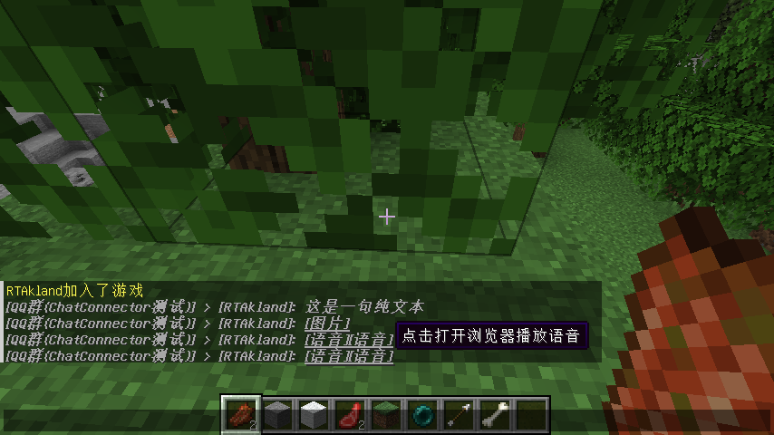
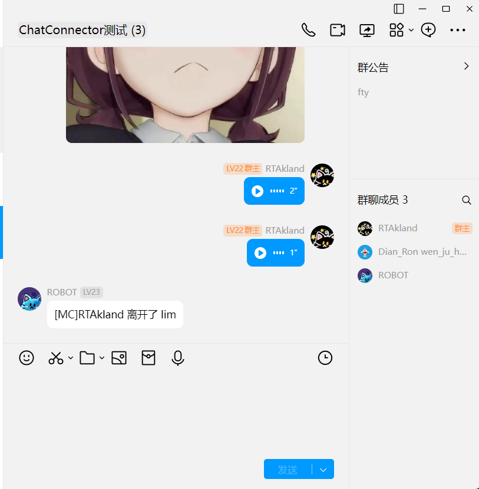

<div align="center">


<h2>ChatConnector</h2>

<h3>⭐一个可以互通QQMC消息以及子服消息同步的 Velocity/Paper/Fabric 插件/模组⭐</h3>


</div>

# 概述

这个插件可以互通QQ和MC的消息, 包括不限于纯文本、同步子服之间的消息(跨服聊天)、远程执行命令
快速添加白名单, 解析消息段并转换成游戏内支持的文本格式(可以点击消息、悬浮文本预览内容), 并且支持将其他子服的玩家显示到玩家列表中

如果你需要任何帮助你可以加入ChatConnector交流群(575300987), 有任何问题都可以在这里面问, 前提是你读完并且了解了本文档。
我会在这个群内测试我的插件

# 展示

<div style="display: flex;">
    
    
</div>


# 使用

!> v3.x已经弃用了Discord/Kook的支持

> 这里不赘述配置OneBot11的实现, 只需要找到一个支持正向Websocket的OneBot11实现  
> 这里给出几个可以用的实现: `Lagrange.OneBot` `Napcat` `LlOneBot`

***注意: 除了Lagrange.OneBot其余都没有测试过, 请自行测试可用性***

## 已支持解析的消息类型

|      功能/平台      | MC向QQ | QQ向MC |
|:---------------:|:-----:|:-----:|
|       纯文本       |   ✅   |   ✅   |
|      通用CQ码      |   ✅   |       |
|       图片        |       |   ✅   | 
|       语音        |       |   ✅   |  
|       艾特        |       |   ✅   |
|      消息链转发      |       |   ✅   |
|       位置        |       |   ✅   |
|       收藏        |       |   ✅   |
|      好友推荐       |       |   ✅   |
|      群聊推荐       |       |   ✅   |
|       文档        |       |   ✅   |
|      音乐分享       |       |   ✅   |
|      班级作业       |       |   ✅   |
|   视频分享(哔哩哔哩)    |       |   ✅   |
|       骰子        |       |   ✅   |
|      石头剪刀布      |       |   ✅   |
|    群公告(不含图片)    |       |   ✅   |
| MiniMessage语法消息 |       |   ✅   |

## 支持的功能

1. 支持在Tab列表中显示出其他子服的玩家名，并且将其他子服的玩家名字设置成灰色
2. 跨服聊天 - 其他子服发的消息可以广播到全部子服
3. 群服互通， 将QQ群和MC的消息相互转发, 也可以设置游戏内转发的前缀, 必须以某个前缀开头的消息才会被转发到QQ群, 默认为任何消息都转发
4. QQ群内执行MC的命令
5. 操作白名单
6. 多QQ群转发 - 多个QQ群的消息转发到MC，MC的消息同样会被转发到所有在配置文件内的群中
7. 快速对一个从QQ群内转发来的消息进行回复就像下面这样  
   
8. 戳一戳机器人快速获取在线玩家列表
9. 映射服务器名称 - 将velocity的子服名称映射成中文转发到群内
10. 可选的屏蔽某个子服的聊天消息
11. 自定义消息转发模板

## 指令

### 游戏内指令

> 游戏内的指令都是/chatc开头的

可用的游戏内指令如下

1. /chatc reconnect - 重连Websocket和Rcon
2. /chatc reply - 回复一个消息
3. /chatc at - at一个群内的成员
4. /chatc check-message - 检查是否有新的广播消息

### 群内指令

> 群内的指令前缀可以为一下三种的任意一个

1. !!
2. ！！
3. /

> 意思就是如果一个命令是`help` 那么你可以在群内发送下面三种情况中的任意一种就能成功执行

1. !!help
2. ！！help
3. /help

可用的群内指令如下

1. !!at <玩家名>  在群内@游戏内的玩家(不论在哪个子服, 只要是通过Velocity连接到的玩家都能@), 被@的玩家会在屏幕上提示(
   但是没有声音, 因为这是Velocity的限制)
2. !!exec <rcon名字> <指令>  在群内对子服执行命令, 需要配置RCOn
3. !!help 帮助
4. !!list 列出在线玩家
5. !!reconnect 重连Websocket和RCON
6. !!status 获取服务器状态
7. !!wh <on | off | add | remove> [玩家名] 操作白名单

# 配置

> 下面是默认的配置

```json5
{
   // 密钥
   "secretKey": "<your secret key here>",
   // 正向ws地址
   "wsAddress": "ws://127.0.0.1:8081/ws",
   // ws密钥
   "accessToken": "1145141919810",
   // 权限管理
   "permission": {
      // owner只能填一个
      "owner": 3458671395,
      // admins可以填多个
      "admins": [
         114514,
         1919810
      ],
      // other可以不用管， 因为所有没在admins或者owner内的qq号默默人都是other
      "others": [
         66666,
         33343131
      ]
   },
   // rcon配置 此项仅在velocity生效, fabric/paper平台不需要管
   "rcons": {
      "enabled": false,
      "rcons": [
         {
            // 实例的名字
            "name": "instance1",
            "host": "127.0.0.1",
            "port": 25577,
            "password": "123456"
         },
         {
            "name": "instance2",
            "host": "127.0.0.1",
            "port": 25599,
            "password": "1919810"
         }
      ]
   },
   // 消息转发样式支持adventure-text语法
   "style": {
      // 跨服聊天样式, 仅在velocity平台生效
      "crossServerMessageStyle": "<green>[{{serverName}}]</green> > [{{playerName}}]: {{message}}",
      // 群聊的消息转发到游戏内的样式
      "groupMessageStyle": "<green>[QQ群({{groupName}})]</green> > [{{senderName}}]: {{message}}",
      // mc的消息转发到群聊中的样式， 不支持adventure-text语法
      "mcMessageStyle": "[MC:{{serverName}}] > [{{playerName}}]: {{message}}"
   },
   // 配置只有以什么开头的消息才会转发， 为空则表示转发全部的消息
   "mcForwardPrefix": "",
   // 是否开启tab列表显示其他子服的玩家， 仅在velocity平台生效
   "enableTabList": false,
   // 是否开启将机器人的名字作为显示在线玩家数的载体
   "enableNicknameAsPlayerCount": true,
   // 是否开启/list指令中是否添加玩家的皮肤的头在消息内
   "enableListCommandPlayerHeadDisplay": true,
   // 是否开启戳一戳返回的玩家列表是否添加玩家的皮肤的头在消息内
   "enableDoubleTapPlayerHeadDisplay": false,
   // 子服名称映射，仅在velocity平台生效
   "subServerNameMap": {
      "lobby": "大厅"
   },
   // 忽略某个子服的消息，这里的名称需要填velocity.toml内的子服名称， 仅在velocity平台生效
   "ignoreChatServers": [],
   // 如果开启了使用bot名称作为玩家数的载体则可以配置此项来自定义名字的样式， 不支持adventure-text语法
   "botNicknameTemplate": "{{botName}} | 在线玩家数: {{onlinePlayerCount}}",
   // /help指令的回复格式， Image为图片, Text为纯文本
   "helpCommandResponseType": "Image",
   // 针对不同的qq群来配置
   "groupsSettings": {
      // 114514是群号
      "114514": {
         // 配置针对本群的事件通知
         "events": [
            // 玩家离开服务器
            "PlayerLeaveEvent",
            // 玩家加入服务器
            "PlayerJoinEvent",
            // 玩家聊天信息
            "PlayerChatEvent",
            // 群聊聊天信息
            "GroupMessageEvent"
         ],
         // 设置只有群聊的消息以某个子服开头才会被转发， 默认全部转发
         "groupForwardPrefix": "",
         // 配置本群的指令开启状态
         "commandEnableStatus": {
            "help": true,
            "list": true,
            "exec": true,
            "status": true,
            "at": true,
            "wh": true,
            "rec": true
         },
         // 配置本群的指令权限管理
         "commandPermission": {
            "help": "Normal",
            "list": "Normal",
            "exec": "Admin",
            "status": "Normal",
            "at": "Normal",
            "wh": "Admin",
            "rec": "Admin"
         }
      }
   },
   // 是否开启跨服聊天
   "enableCrossServerChat": true
}
```

# 注

!> 售出不退！

!> 如果想要增加新的功能，可以联系我获取报价

!> 插件有密钥验证如果不加密钥直接启动的话会直接导致velocity退出！ 并且一个密钥只能有一个客户端同时在线

# 购买

插件有两种购买方式

1. 直接通过微信转账后加我QQ联系
2. 通过工作室官网购买

## 通过微信转账购买

!> 请通过[邮件](mailto:buy@rtast.cn)联系我并进行购买，我会尽可能快的回复您的消息 。 也可以直接通过QQ联系我 `3458671395`。
本插件定价暂时为 `20元(RMB)`。


> 如果你选择先付款而不是先沟通那我默认就认为你知道上面的售出不退, 付完款就加我QQ联系，然后告诉我你的
> 微信名字

## 工作室官网购买

https://studio.yhdzz.cn/shop/1843.html
